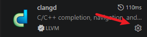
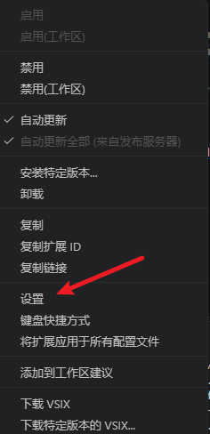
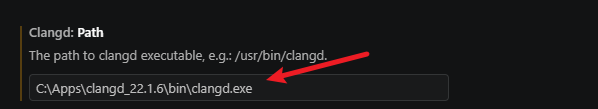

## 常见问题

### 为什么插件没有激活？

- 请确认项目根目录是否存在 `src/SConscript` 文件。

### 命令执行失败怎么办？
- 检查 PowerShell 路径、SDK 脚本路径是否正确。
- 确认 SDK 环境和依赖（如 scons、sftool）是否正常。

### 终端没有自动进入 project 文件夹？
- 请确保根目录中存在名为 `project` 的子文件夹。

### `codebase_index.json` 会在什么时候自动重建？

- 当当前板卡对应的 `codebase_index.json` 不存在时，CodeKit 会自动尝试生成。
- 当 `codebase_index.json` 损坏、解析失败或读取失败时，CodeKit 会自动尝试重新生成。
- 当 `compile_commands.json` 比 `codebase_index.json` 更新时，CodeKit 会认为索引可能已经过期，并自动尝试重建。

如果希望手动触发，也可以执行命令 `Generate codebase_index.json`，或者在工程终端中运行：

```bash
scons --board=<board> --target=json
```

### 为什么 `SDK 依赖源码` 视图里有些文件在 `Unresolved` 下？

- 这通常表示 `codebase_index.json` 中记录的原始 SDK 路径无法映射到当前激活的 SDK。
- 常见原因是：切换了不同版本的 SDK、当前 SDK 不完整，或者索引是用另一套 SDK 生成的。
- 可以先重新生成一次 `codebase_index.json`，再查看是否恢复正常。

### clangd 安装失败，代码无法跳转、补全怎么办？ 

扩展会自动安装，但语言服务器程序需要单独下载，下载失败时代码无法跳转（`F12`、`Ctrl+点击`），也没有补全和诊断。可以手动下载 clangd 并指定其路径：

1. 从浏览器下载`clangd`,并复制`clangd.exe`的文件地址。
2. 在扩展面板中找到 `clangd`，点击右下角的齿轮图标。



3. 在弹出的菜单中选择 `设置`。



4. 在 `Clangd: Path` 中粘贴 `clangd.exe` 的绝对路径，例如 `C:\Apps\clangd_22.1.6\bin\clangd.exe`。



5. 重启 VS Code 使设置生效。

### 串口设备未识别？

- 打开设备管理器，检查串口驱动、连接状态、PowerShell 执行权限。

### 出现类似`无法加载文件 D:\SiFli\SiFli-SDK\export.ps1，因为在此系统上禁止运行脚本`的错误

点击菜单栏中的`终端` -> `新建终端`，在打开的终端中输入以下命令并回车：

```powershell
Set-ExecutionPolicy RemoteSigned
```

然后选择`A`（全部）并回车。之后重启 VSCode 即可。

### 还有其他未知问题？

- 欢迎提交 issue，这对插件的后续开发很有帮助：[GitHub 仓库](https://github.com/OpenSiFli/SiFli-SDK-CodeKit)
